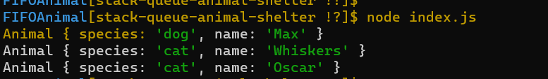
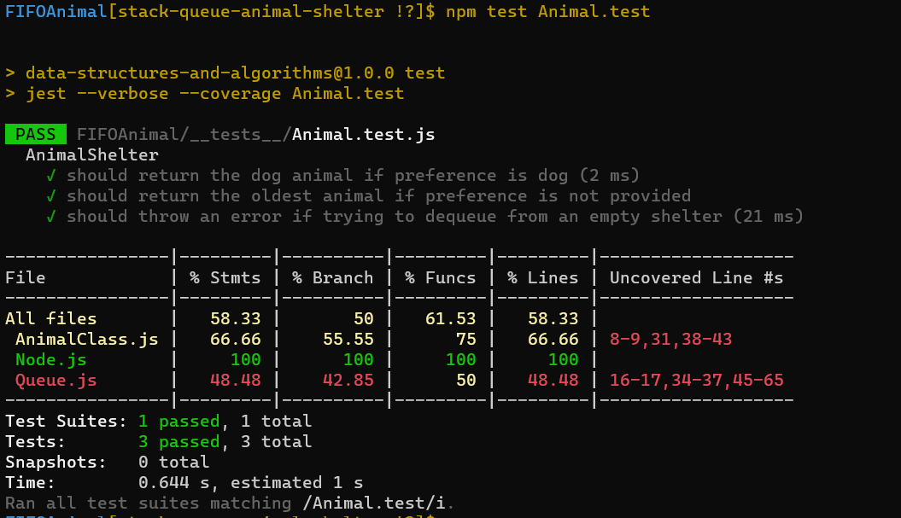

# Code Challenge: Class 12
## Stack and a Queue Implementation

1.   Summary:
                The AnimalShelter class maintains a queue of animals, where the animals are added at the end of the queue and dequeued from the front. The enqueue method adds an animal to the shelter, while the dequeue method removes an animal based on the preference specified. If a specific preference is not provided, the animal that has been waiting in the shelter the longest is dequeued.

2. Description:
                The AnimalShelter class is designed to operate as a first-in, first-out (FIFO) animal shelter. It can hold dogs and cats and provides methods for enqueueing animals into the shelter and dequeuing them based on the preference specified.

## Approach & Efficiency

For the AnimalShelter class, we can use a queue data structure to maintain the order of animals. When enqueueing, we simply add the animal to the end of the queue. When dequeueing, we check the preference specified and dequeue the appropriate animal. If no preference is given, we dequeue the animal from the front of the queue.

## Solution:
1. [Node.js](./lib/Node.js)
2. [Queue.js](./lib/Queue.js)
3. [AnimalClass.js](./lib/AnimalClass.js)
4. [tests](./__tests__/Animal.test.js)
5. [index.js](./index.js)

## Node index.js

## Testing
