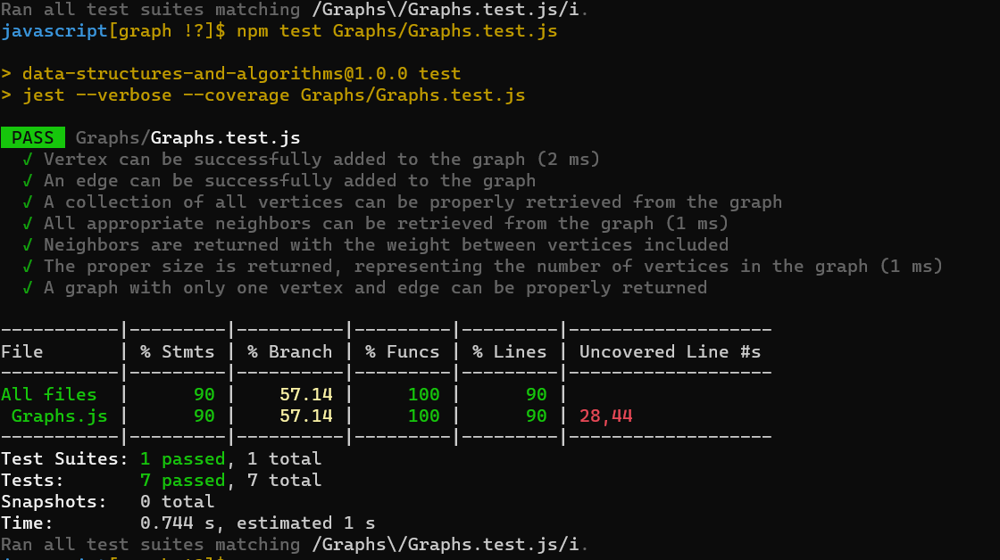

# Code Challenge:
## Graphs

**Description:**

In this challenge, the task is to implement a Graph data structure using an adjacency list representation. A graph consists of vertices (nodes) and edges that connect pairs of vertices. The graph class should include methods to add vertices, add edges between vertices, retrieve vertices and their neighbors, and determine the size of the graph.

**Approach:**

The implementation of the Graph class involves creating two additional classes: `Vertex` and `Edge`.

1. **Vertex Class:**
   - The `Vertex` class holds the value of the vertex and an array to store its edges.
   - Each vertex has a value and an associated list of edges connected to it.

2. **Edge Class:**
   - The `Edge` class represents an edge between two vertices.
   - Each edge has a reference to the destination vertex and an optional weight.

3. **Graph Class:**
   - The `Graph` class maintains a Map that associates each vertex with its list of edges.
   - The class provides methods to:
     - Add vertices (`addVertex`): Creates a new vertex and adds it to the graph.
     - Add edges (`addEdge`): Adds an edge between two vertices with an optional weight.
     - Get vertices (`getVertices`): Returns an array of all vertices in the graph.
     - Get neighbors (`getNeighbors`): Returns an array of edges connected to a given vertex.
     - Determine size (`size`): Returns the number of vertices in the graph.

**Efficiency:**

- Adding a vertex is O(1) as it involves creating a new vertex object and adding it to the map.
- Adding an edge is O(1) as it involves appending the edge to the list of edges for both vertices.
- Retrieving all vertices is O(V), where V is the number of vertices.
- Retrieving neighbors of a vertex is O(E), where E is the number of edges connected to the vertex.
- Determining the size is O(1) as it involves returning the size of the map.

Overall, the efficiency of the graph operations is generally very good due to the use of an adjacency list representation. However, the efficiency can degrade in scenarios where the graph becomes very dense and approaches a complete graph (V*(V-1)/2 edges).

In summary, the adjacency list representation strikes a good balance between memory usage and efficient operations for graphs with relatively sparse connectivity.

**Conclusion:**

The implementation of the Graph class using an adjacency list provides an efficient and flexible way to represent and work with graphs. This approach allows for easy addition of vertices and edges, efficient retrieval of neighbors, and maintaining the size of the graph. The adjacency list representation is well-suited for various graph-related applications.

## Solution:
1. [Graphs code](./Graphs.js)
2. [Graphs test](./Graphs.test.js)

## Testing
