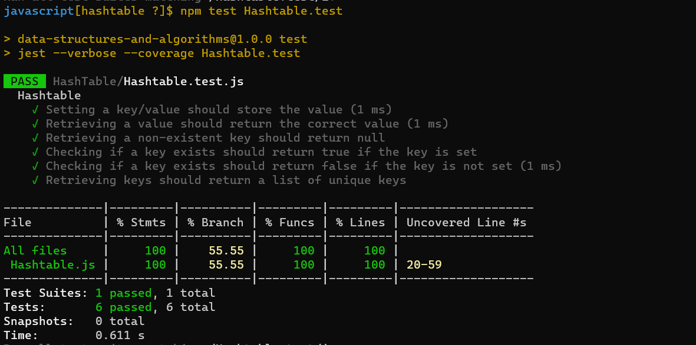

## Hash Table 

### What is a Hashtable?
A hashtable, also known as a hash map, is a data structure that provides efficient data storage and retrieval by using a key-value mapping mechanism. In a hashtable, data is stored in an array-like structure, where each element is associated with a unique key. This key serves as an index, allowing for fast access to the corresponding value. Hashtables are widely used in computer science for their constant-time average case performance in retrieval operations.

### Explanation of Key-Value Pairs and their Relation to Hashtables
In a hashtable, data is stored in key-value pairs. The key is a unique identifier that serves as a reference to the associated value. The value can be any data, such as a string, number, object, or even another data structure. The key-value relationship is at the core of hashtables and enables efficient data retrieval. When you want to retrieve a value, you provide its corresponding key, allowing the hashtable to quickly locate and return the associated value.

### Importance of Fast Data Retrieval
One of the key advantages of hashtables is their ability to achieve fast data retrieval. Traditional array structures require iterating through the entire collection to find a specific element, resulting in linear time complexity. However, hashtables leverage a process called hashing to map keys to specific indices in the underlying array. This process allows for constant-time average case performance in retrieval operations. In essence, hashtables dramatically reduce the time complexity for accessing and manipulating data.

###  Step-by-Step Guide to Creating a Simple Hashtable Class

Creating a simple hashtable class involves defining the necessary methods and an underlying data structure to store the key-value pairs. In this example, we'll use an array to represent the buckets, where each bucket may contain multiple key-value pairs due to collisions.

```javascript
class Hashtable {
    constructor(size = 100) {
        this.size = size;
        this.buckets = new Array(size).fill(null).map(() => []);
    }

    // Other methods will be defined here...
}
```

### Defining Methods for Set, Get, Has, Keys, and Hash Operations

 `set(key, value)`
The `set` method adds a new key-value pair to the hashtable. If the key already exists, it updates the associated value.

```javascript
set(key, value) {
    const index = this.hash(key);
    const bucket = this.buckets[index];

    for (const pair of bucket) {
        if (pair[0] === key) {
            pair[1] = value;
            return;
        }
    }

    bucket.push([key, value]);
}
```

`get(key)`
The `get` method retrieves the value associated with a given key.

```javascript
get(key) {
    const index = this.hash(key);
    const bucket = this.buckets[index];

    for (const pair of bucket) {
        if (pair[0] === key) {
            return pair[1];
        }
    }

    return null;
}
```

`has(key)`
The `has` method checks whether a key exists in the hashtable.

```javascript
has(key) {
    const index = this.hash(key);
    const bucket = this.buckets[index];

    for (const pair of bucket) {
        if (pair[0] === key) {
            return true;
        }
    }

    return false;
}
```

`keys()`
The `keys` method returns an array of all unique keys in the hashtable.

```javascript
keys() {
    const keys = [];

    for (const bucket of this.buckets) {
        for (const pair of bucket) {
            if (!keys.includes(pair[0])) {
                keys.push(pair[0]);
            }
        }
    }

    return keys;
}
```

### Hash Function

The hash function is a critical component of the hashtable as it determines how keys are mapped to indices in the array. A simple hash function could involve summing the ASCII values of the characters in the key:

```javascript
hash(key) {
    let hash = 0;

    for (let i = 0; i < key.length; i++) {
        hash += key.charCodeAt(i);
    }

    return hash % this.size;
}
```

This example demonstrates how to create a basic hashtable class with key functionalities like setting values, getting values, checking for key existence, retrieving keys, and implementing a hash function. You can build upon this foundation to create more advanced hashtables or incorporate other features as needed.

---
### Code and Test files
Code: 
[Hash Table](./Hashtable.js)


Test: [Hash Table Test](./Hashtable.test.js)


