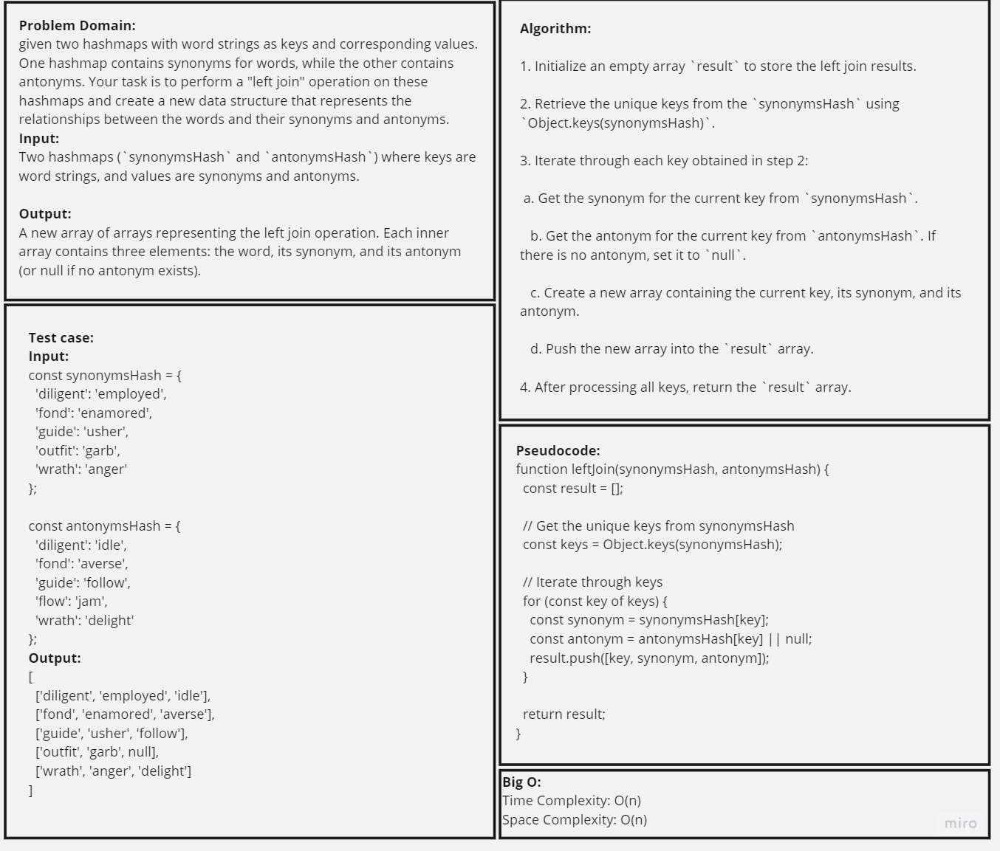
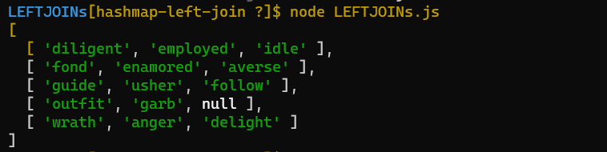
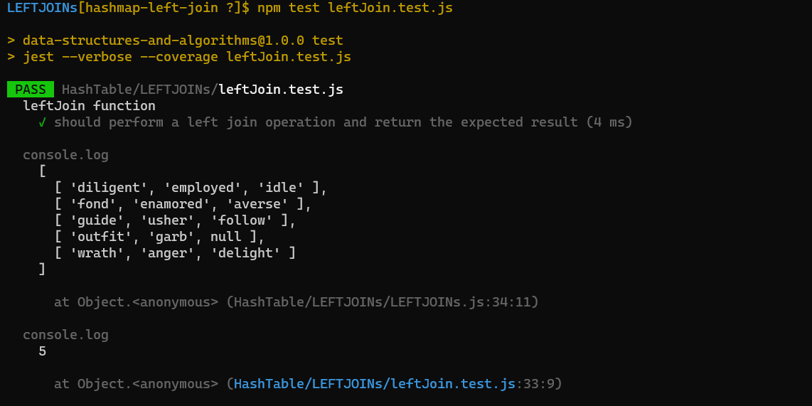

# Code Challenge:
## Left Join Two Hash Maps

### Summary

The "Left Join Hashmaps" problem involves combining two hashmaps, one containing synonyms and the other containing antonyms, to create a new data structure representing the relationships between words and their synonyms and antonyms. The approach involves iterating through the keys of the `synonymsHash`, retrieving corresponding values from both hashmaps, and constructing an array with the word, its synonym, and its antonym (if available). These arrays are then collected in the `result` array, which is returned as the final left join result.

### Description:

In this challenge, the task is to implement a Graph data structure using an adjacency list representation. A graph consists of vertices (nodes) and edges that connect pairs of vertices. The graph class should include methods to add vertices, add edges between vertices, retrieve vertices and their neighbors, and determine the size of the graph.

### Whiteboard

### Efficiency Analysis

**Time Complexity**: The time complexity of this solution is O(n), where n is the number of unique keys in the `synonymsHash` hashmap. This is because we iterate through each key in the `synonymsHash` and perform constant-time operations to retrieve synonyms and antonyms.

**Space Complexity**: The space complexity is also O(n), where n is the number of unique keys. We store the result in a new array, which contains n elements.

### Approach

1. Initialize an empty array `result` to store the left join results.

2. Retrieve the unique keys from the `synonymsHash` using `Object.keys(synonymsHash)`.

3. Iterate through each key obtained in step 2:
   - Get the synonym for the current key from `synonymsHash`.
   - Get the antonym for the current key from `antonymsHash`. If there is no antonym, set it to `null`.
   - Create a new array containing the current key, its synonym, and its antonym.
   - Push the new array into the `result` array.

4. After processing all keys, return the `result` array.

## Solution:
1. [Left Join code](./LEFTJOINs.js)
2. [Left Join test](./leftJoin.test.js)

## Testing

