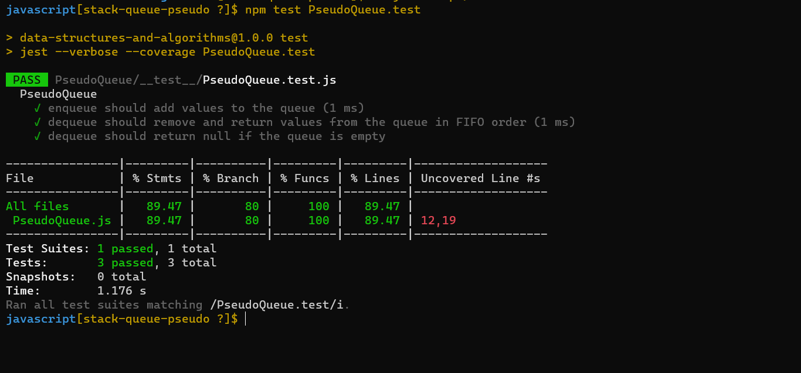

# Code Challenge: Class 11
## Implement a Queue using two Stacks

1.   Summary:
                The task is to implement a PseudoQueue class that emulates a queue data structure using two stacks. The class should have two methods: `enqueue`, which adds an element to the queue, and `dequeue`, which removes an element from the queue. The PseudoQueue class internally uses two stack instances to manage the elements in a first-in, first-out (FIFO) manner.

2. Description:
                A queue is a data structure that follows the FIFO principle, where the first element added is the first one to be removed. In this case, we are implementing a queue using two stacks. The key idea is to use one stack for the `enqueue` operation and the other stack for the `dequeue` operation.

    To enqueue an element, we can simply push it onto the first stack. To dequeue an element, we need to transfer all the elements from the first stack to the second stack in reverse order, effectively reversing the order of elements. Then, we can pop the top element from the second stack, which corresponds to the front of the queue.

## Whiteboard Process

## Approach & Efficiency

The time complexity of the `enqueue` operation is O(1) because it involves a simple push operation on `stack1`. The time complexity of the `dequeue` operation is O(n) in the worst case, where n is the number of elements in the queue. This is because transferring elements from `stack1` to `stack2` takes O(n) time. However, in the average case, where elements are evenly distributed between the two stacks, the amortized time complexity of the `dequeue` operation is O(1).

The space complexity of the PseudoQueue class is O(n), where n is the number of elements in the queue. This is because we are using two stacks to store the elements.

Overall, this approach provides an efficient implementation of a queue using two stacks.

Please note that the pseudocode provided is a high-level representation of the approach and may require additional implementation details depending on the programming language used.

## Solution:
1. [PseudoQueue](./PseudoQueue.js)
2. [tests](./__test__/PseudoQueue.test.js)

## Testing
