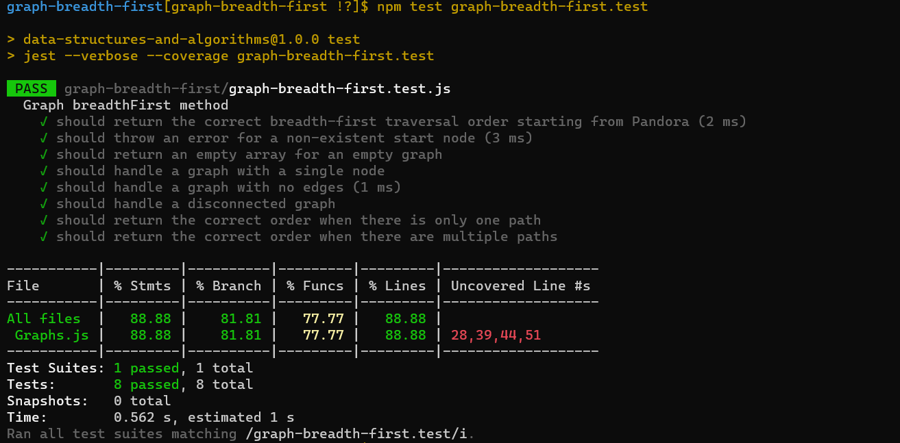

# Code Challenge:

## Implement a breadth-first traversal on a graph.

**Description:**

In this challenge, the task is to implement a breadth-first traversal on a graph. A breadth-first traversal explores a graph by visiting all the nodes at the current level before moving on to nodes at the next level. This traversal technique helps in finding the shortest path between nodes in an unweighted graph and is useful for various graph-related problems.

**Whiteboard**

**Approach:**

To perform a breadth-first traversal of a graph, we'll need a queue data structure to keep track of the nodes to visit. We'll start with an initial node, enqueue it into the queue, mark it as visited, and then iterate through the queue while there are nodes to process.

Here's the step-by-step approach:

1. Initialize an empty queue, a set to keep track of visited nodes, and an array to store the traversal order.
2. Enqueue the starting node into the queue and mark it as visited.
3. While the queue is not empty:
   a. Dequeue a node from the queue.
   b. Add the node to the traversal order.
   c. Iterate through the neighbors of the current node:
      - If a neighbor has not been visited:
        - Enqueue the neighbor.
        - Mark the neighbor as visited.
4. Return the traversal order.

**Efficiency:**

- Time Complexity: The time complexity of a breadth-first traversal is O(V + E), where V is the number of vertices (nodes) and E is the number of edges in the graph. This is because we visit each vertex and edge once.

- Space Complexity: The space complexity is O(V) because, in the worst case, we may need to store all vertices in the queue.

**Conclusion:**

A breadth-first traversal of a graph is a fundamental algorithm for exploring graphs. It is useful for various graph-related problems, including finding the shortest path in an unweighted graph. The implementation described above is efficient and follows best practices for graph traversal.

**Big O Calculation:**

- Time Complexity: O(V + E)
- Space Complexity: O(V)

## Solution:
1. [graph-breadth-first code](./graph-breadth-first.js)
2. [graph-breadth-first test](./graph-breadth-first.test.js)

## Testing

