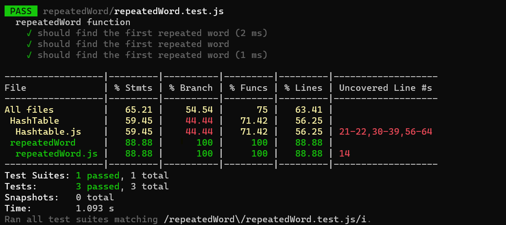

## Find the first repeated word in a book. :

### Description:

The "repeatedWord" function takes an input string and is designed to find and return the first repeated word in the given string. It processes the input string by splitting it into words, using a hash table to track word occurrences, and identifying the first repeated word.

-------
### Whiteboard

______________

### Approach & Efficiency:

**Approach:**

1. Create an empty hash table (`wordHashtable`) to track word occurrences.

2. Split the input string into words using regular expressions, and store the resulting words in an array (`words`).

3. Iterate through each word in the `words` array:
   - Convert the word to lowercase to ensure case-insensitivity.
   - Check if the lowercase word exists in the `wordHashtable`.
     - If it exists, return the lowercase word as the first repeated word.
     - If it doesn't exist, add the lowercase word to the `wordHashtable` with a value indicating its occurrence.

4. If no repeated word is found after iterating through all words, return `null`.

**Efficiency:**

- Time Complexity: The algorithm's time complexity is mainly determined by the number of words (`n`) in the input string. The process of splitting the string into words takes O(n), and the subsequent loop through the words takes O(n) as well. Hash table operations (hashing, setting, and checking) within the loop are typically O(1), assuming a well-distributed hash function. Therefore, the overall time complexity is O(n).

- Space Complexity: The space complexity is influenced by the space used for the hash table and the array of split words. In the worst case, when all words are unique, the space complexity is O(n) due to the hash table. Additional space used by variables and temporary storage is negligible compared to the hash table. Therefore, the overall space complexity is O(n).

_____________________
### Solution:
1. [repeatedWord.js](./repeatedWord.js)
2. [test.js](./repeatedWord.test.js)
____________________________________
### testing image:
